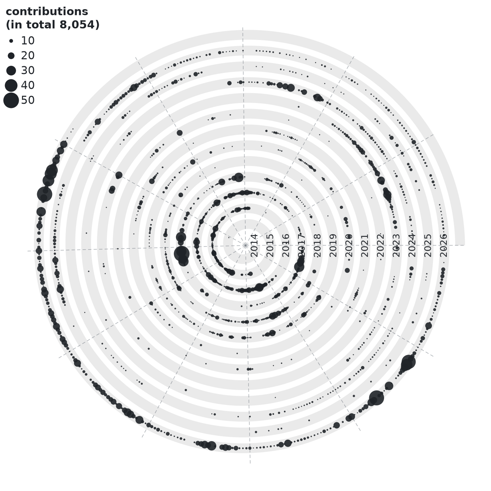

# spiral-git

Your entire GitHub history as a spiral — one loop per calendar year, angle =
day-of-year, dot size = that day's activity. A Python port of
[jokergoo's spiralize post](https://jokergoo.github.io/2022/02/03/spiral-visualization-of-daily-git-commits/),
pointed at a whole account instead of a single local repo.



Because angle is day-of-year, the same calendar date sits on the same radial
line in every loop — so seasonal habits (the December lull, the September
restart) show up as spokes, which a linear heatmap can't show you.

## Setup

```sh
./setup.sh
```

Creates `.venv` and installs matplotlib and requests. It uses `uv` rather than
`python -m venv` because Ubuntu ships 3.12 without `ensurepip`; if you'd rather
not install uv, `sudo apt install python3.12-venv` and use the stdlib venv.

## Token

`./fetch.sh` reads `GITHUB_TOKEN` (or `GITHUB_PAT`) from the environment or
from a gitignored `.env` beside the scripts. Mint one at
<https://github.com/settings/tokens>:

- **Classic token** — tick `read:user`. Add `repo` if you want commits in
  private repositories counted.
- **Fine-grained token** — no extra permissions needed for public data; grant
  read access to specific repos for private counts.

```sh
echo 'GITHUB_TOKEN=ghp_xxxxxxxxxxxx' > .env    # or: export GITHUB_TOKEN=...
```

Two settings on GitHub's side affect what comes back, and neither is something
the token can override:

1. Profile → **Contribution settings → Include private contributions on my
   profile.** Off, and private work is returned only as an opaque
   `restrictedContributionsCount` total, not as daily numbers.
2. Commits only count toward the calendar if the commit email is
   [linked to your account](https://github.com/settings/emails). Work committed
   under a stale `user.email` is invisible here — check the per-year totals the
   fetcher prints against your profile graph before trusting the picture.

## Run

Two commands, and only the first touches the network:

```sh
./fetch.sh    # pull  -> data/contributions.csv   (needs a token)
./build.sh    # build -> docs/spiral.png + .svg   (no token, ~1s)
```

Re-run `./build.sh` as often as you like while tuning — it reads the cached
CSV, so there's no reason to re-fetch. Pull fresh numbers only when you want
them. `./run.sh` does both in sequence if you'd rather have one command.

`./build.sh` writes to `docs/spiral.png`, the image embedded above, so a
rebuild updates the README in place.

Both scripts pass extra flags through to the Python underneath, and those
override the defaults:

```sh
./fetch.sh --since 2018
./build.sh --theme dark
./build.sh --column commits --out docs/commits.png
```

Fetch options:

| flag | effect |
|---|---|
| `--user LOGIN` | someone else's public history (default: the token's owner) |
| `--since 2018` | skip early years |
| `--out PATH` | CSV destination |

The CSV has three columns — `date`, `contributions`, `commits`.

`contributions` is the green-squares number: commits **plus** issues opened,
pull requests opened, PR reviews submitted, and repositories created. It is
the sum GitHub itself renders on your profile.

`commits` is commit-only, reconstructed from the per-repository breakdown —
so it is a strict subset of `contributions`, and it is only complete when the
token carries `repo` scope (see [What actually
counts](#what-actually-counts)).

## Render

```sh
./build.sh --column commits --theme dark --out docs/commits.png
```

| flag | default | notes |
|---|---|---|
| `--in` | `data/contributions.csv` | source CSV |
| `--column` | `contributions` | or `commits` |
| `--theme` | `light` | or `dark` |
| `--cap` | `30` | floor for the dot-size ceiling; the actual cap is `max(cap, 0.9 × busiest day)`, so a few 200-commit days can't flatten everything else |
| `--min-pt` / `--max-pt` | `1` / `20` | smallest and largest dot diameter in points — drop the max if your loops overlap |
| `--loop-gap` | `1.0` | radial distance between years; raise it for a long history |
| `--inner-radius` | `0.6` | size of the hole in the middle |
| `--size` / `--dpi` | `11` / `160` | figure inches and resolution |
| `--no-normalize-year` | off | by default day-of-year is divided by that year's real length so leap years stay aligned; this turns that off |
| `--title` | none | the legend title carries the caption, so a heading appears only if you ask for one |

An SVG is written alongside any non-SVG output.

Two constants near the top of `spiral.py` control proportions the flags don't
reach:

| constant | default | effect |
|---|---|---|
| `BAND_FRACTION` | `0.62` | share of the loop pitch filled by the ribbon; the rest is the gap |
| `LABEL_BAND_RATIO` | `0.85` | year-label height as a share of the ribbon width. Rotated 90°, a year's glyph height runs radially, so this is what keeps it inside the band. Digit cap-height is roughly 0.7 em, so past about `1.4` the glyphs spill over the gaps |

## Reading it

Jan 1 is at 3 o'clock and time runs clockwise, so every loop begins on the east
axis — which is why the year labels stack along it as a ruler. Years read
outward, innermost loop first. Each loop is a filled ribbon; dot area is the
day's count, clamped so outliers can't flatten the scale. The dashed spokes
mark month boundaries, and the legend title carries the grand total.

## Layout

```
setup.sh                 create .venv, install matplotlib + requests
fetch.sh                 -> data/contributions.csv   (the only script that needs a token)
build.sh                 -> docs/spiral.png + .svg   (no network)
run.sh                   fetch.sh then build.sh

fetch_contributions.py   GraphQL client behind fetch.sh
spiral.py                renderer behind build.sh

data/                    fetched CSVs        (gitignored)
docs/spiral.png          the image above     (committed)
docs/spiral.svg          vector twin         (gitignored — ~1.2 MB of scatter points)
.env                     GITHUB_TOKEN        (gitignored)
```

## What actually counts

These plots inherit GitHub's contribution rules wholesale — they are not a raw
`git log` over everything you've ever written.

**Forks are excluded.** GitHub only counts commits made in a standalone
repository; commits pushed to a fork never reach the contribution calendar, no
matter whose fork it is or what the token can see. If those commits later land
upstream through a pull request, the *PR* counts as one contribution — but the
individual commits still don't. There is no API flag that turns this off. If
your fork work matters to you, the only way to capture it is to clone the forks
and aggregate `git log --author=<you>` locally.

Two further exclusions from the same rule set: commits outside the default
branch (and `gh-pages`) don't count, and commits authored under an email that
isn't [linked to your account](https://github.com/settings/emails) don't count.

**Private repositories are included.** Their daily numbers land in the
`contributions` column like any other, they're just anonymized — GitHub reports
them as an opaque `restrictedContributionsCount` rather than naming the repo.
You can confirm this in the fetcher's per-year output: a year printed as
`2,119 contributions (45 commit-contribs, 2,061 private)` has the 2,061 private
ones *inside* the 2,119, otherwise the total would read 58.

This is why `--column contributions` is the honest default and `commits` is
not: the `commits` column is rebuilt from the per-repository breakdown, which
private repos only appear in when the token carries `repo` scope. Two
prerequisites for private work to show up at all:

1. A token with `repo` scope (needed only for the `commits` column — the
   `contributions` column works without it).
2. Profile → **Contribution settings → Include private contributions on my
   profile** switched on.

## Caveats

- The calendar API returns at most one year per call, so the fetcher makes one
  request per year of your account's life. A 10-year account is 10 requests —
  nowhere near the 5000/hr limit.
- **The `commits` column needs `repo` scope.** Without it, GitHub returns your
  private activity only as an anonymous `restrictedContributionsCount` — the
  daily totals are still correct, but the per-repository breakdown that
  `commits` is built from comes back nearly empty. If the fetcher's per-year
  output shows a large `private` number next to a small `commit-contribs`
  number, that's what happened: use `--column contributions`, or re-mint the
  token with `repo` and re-run.
- Commit-only counts also undercount a repository with more than 100 active
  days in a single year; the fetcher prints a warning naming any repo-year
  affected. The `contributions` column is exact regardless.
- Forks, non-default branches and unlinked commit emails are all excluded by
  GitHub before the data ever reaches us — see [What actually
  counts](#what-actually-counts). This mirrors your profile graph exactly; it
  is not a raw `git log` count.
